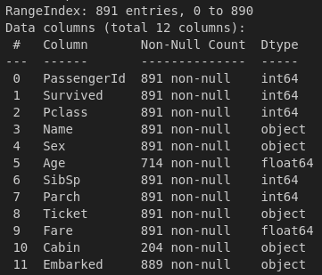

# Titanic Dataset Analysis

## **Overview**
- The **Titanic Dataset** contains the detailed information about the passenger's aboard on it, which sank during its first commute on **April 15, 1912**. After colliding with the **ice-berg**. 
- The primary objective of analyzing this dataset is to extract some useful insights for the passenger survival on vairous features.

#### **Columns**
The dataset includes the following columns:

- **PassengerId:** A unique identifier for each passenger
- **Survived:** Indicated if the passenger suvived (1) or, not (0)
- **Pclass:** Ticket Class for the passengers aboard (1st, 2nd, 3rd)
- **Name:** Passenger's full name
- **Sex:** Gende of the passenger
- **Age:** Age of the passenger
- **Sibsp:** Number of sibling, spouses
- **Parch:** Number of Parents, children
- **Ticket:** Ticket Number
- **Fare:** Passenger fare
- **Cabin:** Cabin number (some are mentioned in dataset in series like B1-B10)
- **Embarked:** Port of embarkation (C for Cherbourg, Q for Queenstown, S for       Southhampon)

## Cleaning of Dataset

As now we have a basic knowledge of what dataset is about, and on which columns the whole dataset is comprised of. Let's start cleaning the dataset: 

- Our dataset is comprised of 11 columns with total 891 entries for each column.

- Now let's see the columns where the entries are not 891. But instead they have missing/null values in those columns. 

---

## Dataset Used
[Titanic Dataset (Kaggle)](https://www.kaggle.com/c/titanic/data)

The dataset consists of passenger details such as age, gender, ticket class, fare, and survival status.

- **`train.csv`** → Used for analysis & training (Contains `Survived` column)